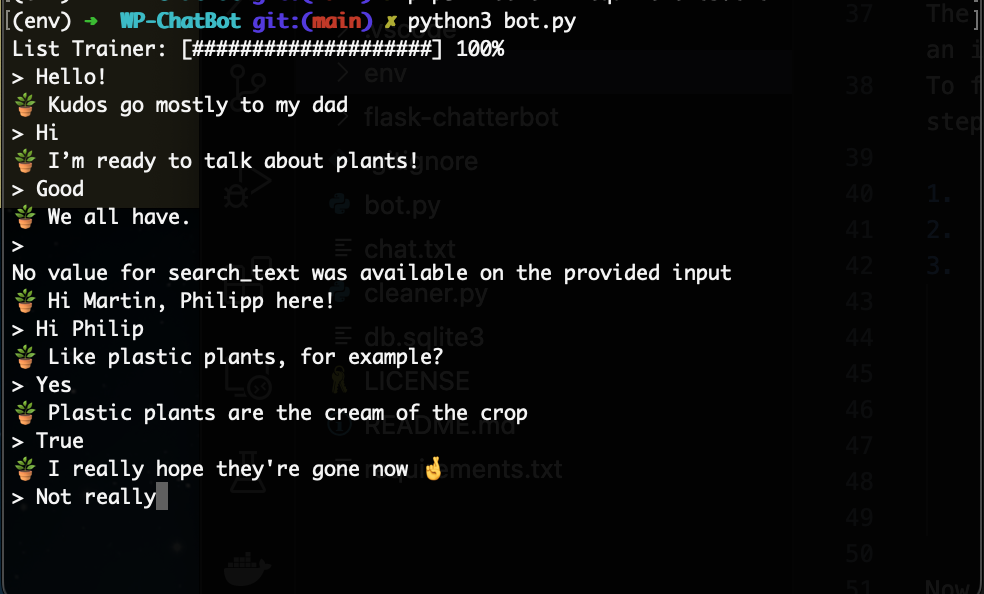

# WP-ChatBot

## Installation terminal program

Once you have clone the project or unzip it.
Open a terminal windows, move to the location of your project

<pre><code>cd path/to/project</code></pre>

First, you have to create your virtual enviroment by running

<pre><code>python3 -m venv [Name_of_Vitual_enviroment]
e.g: python3 -m venv env</code></pre>

You can choose any name of your choice commonly used is "env"

After creating the virtual enviroment, you will need to activate it.

Do so by runnig:

<pre><code>source env/bin/activate</code></pre>

This will activatethe virtual enviroment.

### **Install Packages**:

To install all Packages:

$Run$:

    python3 -m pip install -r requirements.txt

This will install all library Packages.

[NOTE]:

The package `chatterbot` which we are using is under development and so has an issue
To fix this issue that may arise when you want to run the bot, follow the steps below

1.  Go to `env/lib/python3.7/site-packages`
2.  Look for `chatterbot > tagging` file
3.  Change the Code on `[line 13]` of the file to:

            if self.language.ISO_639_1.lower() == 'en':
                self.nlp = spacy.load('en_core_web_sm')
            else:
                self.nlp = spacy.load(self.language.ISO_639_1.lower())

    Then save and close the file.

Now lets run our bot typing:

    python3 bot.py

This will load all trained data and start the bot so we interact with it. as shoule here:

**_Once you are done interacting with the bot,_**

To stop the bot, type:

    :q

### To run the Flack program

Using same virtual enviroment, move into the flask-chatterbot folder by:

    cd flask-chatterbot

then run:

    python3 -m pip install -r requirements.txt

This will install all packages.

Since we already fixed the chatterbot package error we don't have to do that again.

[Now Run]:

    python3 app.py

You can find a simple Hosted Vesion of the application at [mimia.pythonanywhere.com](https://mimia.pythonanywhere.com/) 